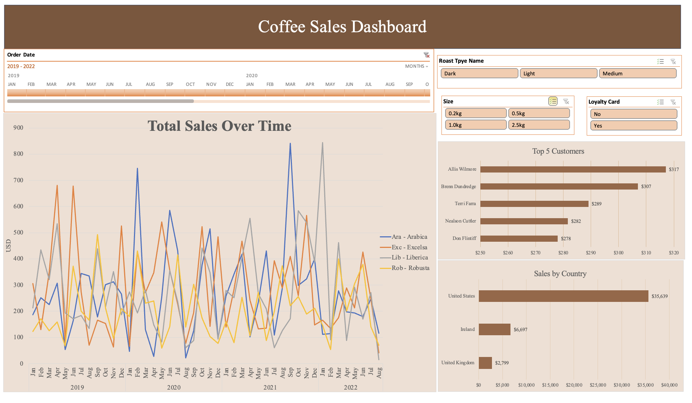

# Analyze Coffee Sales Data in Excel

This is an Excel Project analyzing some Coffee Orders Data by building up an interactive dashboard.



[](LICENSE)
[](https://github.com/christinazyn/excel-project-coffee-sales/stargazers)
[](https://github.com/christinazyn/excel-project-coffee-sales/network/members)
[](https://github.com/christinazyn/excel-project-coffee-sales/issues)
[](https://github.com/christinazyn/excel-project-coffee-sales/pulls)

## Table of Contents

- [Demo](#demo)
- [Data](#data)
- [Steps](#steps)
- [Contributing](#contributing)
- [Acknowledgments](#acknowledgments)

## Demo

[Please Click Here](https://1drv.ms/x/s!AtS71s00CmdLgQC0cZ_a2H9m1J8_)

## Data

There are three tables in this dataset.

- Orders Table: OrderID, OrderDate, CustomerID, ProductID and Quantity
- Customers Table: CustomerID, CustomerName, PhoneNumber, LoyaltyCard etc.
- Products Table: ProductID, CoffeeType, RoastType, Size, UnitPrice, PricePer100g, Profit

## Steps

- Join Data: Match Customers Table and Products Table with Orders Table using XLOOPUP and INDEX MATCH.
- Format Data: Using IF functions, Date Format, Number Format and checking duplicates.
- Build Up Dashboards: Pivot tables and charts. Insert timeline and slicers.

## Contributing

Suggestions are welcome!

## Acknowledgments

Great thanks to an amazing Youtuber [@Mo Chen](https://github.com/mochen862) for providing the data and tutorial of designing the dashboard.

```bash
# Clone the repository
git clone https://github.com/christinazyn/excel-project-coffee-sales.git

# Change directory
cd excel-project-coffee-sales
```
